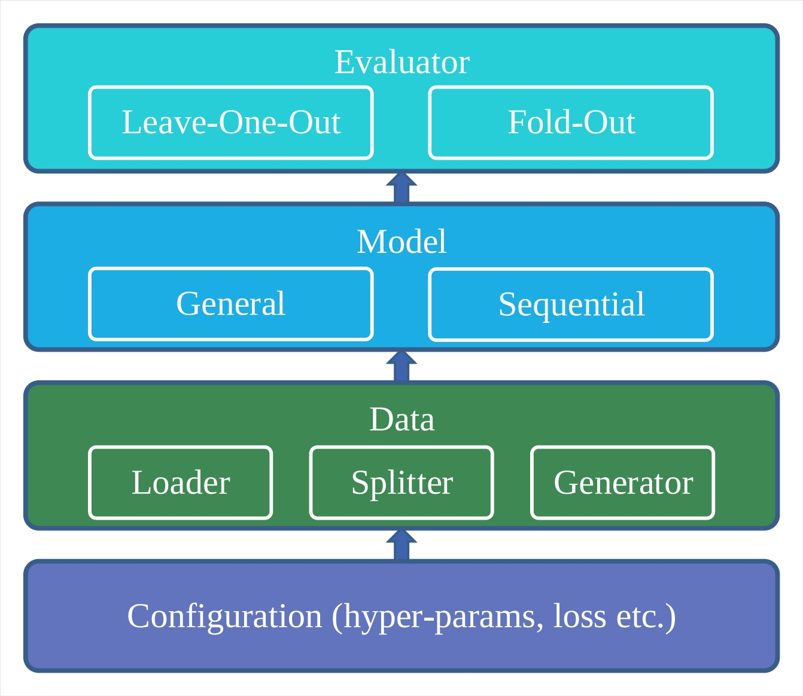

# NeuRec

## An open source neural recommender library

**Main Contributors**: [Bin Wu](https://github.com/wubinzzu), [Zhongchuan Sun](https://github.com/ZhongchuanSun), [Xiangnan He](http://staff.ustc.edu.cn/~hexn/), [Xiang Wang](https://xiangwang1223.github.io), & [Jonathan Staniforth](https://github.com/jonathanstaniforth)

**NeuRec** is a comprehensive and flexible Python library for recommender systems that includes a large range of state-of-the-art neural recommender models. This library aims to solve general, social and sequential (i.e. next-item) recommendation tasks, using the [Tensorflow](https://www.tensorflow.org/) library to provide 33 models out of the box. NeuRec is [open source](https://opensource.org) and available under the [MIT license](https://opensource.org/licenses/MIT).

## Features

* **Cross platform** - run on any operating system with the available Docker images;
* **State-of-the-art** - 33 neural recommender models available out of the box;
* **Flexible configuration** - easily change the configuration settings to your exact requirements;
* **Easy expansion** - quickly include models or datasets into NeuRec;
* **Fast execution** - naturally support GPU, with a mutli-thread evaluator;
* **Detailed documentation** - extensive documentation available as Jupyter notebooks in [tutorial.ipynb](./tutorial.ipynb).

## Architecture

The architecture of NeuRec is shown in the diagram below:



## Quick Start

Firstly, download this repository and unpack the downloaded source to a suitable location.

Secondly, go to '*./NeuRec*' and compline the evaluator of cpp implementation with the following command line:

```bash
python setup.py build_ext --inplace
```

If the compilation is successful, the evaluator of cpp implementation will be called automatically.
Otherwise, the evaluator of python implementation will be called.

**Note that the cpp implementation is much faster than python.**

Thirdly, specify dataset and recommender in configuration file *NeuRec.properties*.

Finally, run [main.py](./main.py) in IDE or with command line:

```bash
python main.py
```

## Tutorial

The short introduction to NeuRec is described in [tutorial.ipynb](./tutorial.ipynb)

## Models

The list of available models in NeuRec, along with their paper citations, are shown below:

| General Recommender | Paper                                                                                                                           |
|---------------------|---------------------------------------------------------------------------------------------------------------------------------|
| GMF, MLP, NeuMF     | Xiangnan He et al., Neural Collaborative Filtering , WWW 2017.                                                                  |
| BPRMF               | Steffen Rendle et al., BPR: Bayesian Personalized Ranking from Implicit Feedback. UAI 2009.                                     |
| FISM                | Santosh Kabbur et al., FISM: Factored Item Similarity Models for Top-N Recommender Systems. KDD 2013.                           |
| NAIS                | Xiangnan He et al., NAIS: Neural Attentive Item Similarity Model for Recommendation . TKDE2018.                                 |
| DeepICF             | Feng Xue et al., Deep Item-based Collaborative Filtering for Top-N Recommendation. TOIS 2019.                                   |
| ConvNCF             | Xiangnan He et al., Outer Product-based Neural Collaborative Filtering . IJCAI 2018.                                            |
| DMF                 | Hong-Jian Xue et al., Deep Matrix Factorization Models for Recommender Systems. IJCAI 2017.                                     |
| CDAE, DAE           | Yao Wu et al., Collaborative denoising auto-encoders for top-n recommender systems. WSDM 2016.                                  |
| MultiDAE, MultiVAE  | Dawen Liang, et al., Variational autoencoders for collaborative filtering. WWW 2018.                                            |
| JCA                 | Ziwei Zhu, et al., Improving Top-K Recommendation via Joint Collaborative Autoencoders. WWW 2019.                               |
| IRGAN               | Jun Wang, et al., IRGAN: A Minimax Game for Unifying Generative and Discriminative Information Retrieval Models. SIGIR 2017.    |
| CFGAN               | Dong-Kyu Chae, et al., CFGAN: A Generic Collaborative Filtering  Framework based on Generative Adversarial Networks. CIKM 2018. |
| APR                 | Xiangnan He, et al., Adversarial Personalized Ranking for Recommendation. SIGIR 2018.                                           |
| SpectralCF          | Lei Zheng, et al., Spectral Collaborative Filtering. RecSys 2018.                                                               |
| NGCF                | Xiang Wang, et al., Neural Graph Collaborative Filtering. SIGIR 2019.                                                           |
| WRMF                | Yifan Hu, et al., Collaborative Filtering for Implicit Feedback Datasets. ICDM 2008.                                            |
| LightGCN            | Xiangnan He, et al., LightGCN: Simplifying and Powering Graph Convolution Network for Recommendation. SIGIR 2020.               |

| Social Recommender | Paper                                                                                                      |
|------------------------|------------------------------------------------------------------------------------------------------------|
| SBPR                | Tong Zhao et al., Leveraging Social Connections to Improve Personalized Ranking for Collaborative Filtering. CIKM 2014.         |
| DiffNet                    | Le Wu et al., A Neural Influence Diffusion Model for Social Recommendation, SIGIR 2019. |


| Sequential Recommender | Paper                                                                                                      |
|------------------------|------------------------------------------------------------------------------------------------------------|
| FPMC, FPMCplus         | Steffen Rendle et al., Factorizing Personalized Markov Chains for Next-Basket Recommendation, WWW 2010.    |
| HRM                    | Pengfei Wang et al., Learning Hierarchical Representation Model for NextBasket Recommendation, SIGIR 2015. |
| NPE                    | ThaiBinh Nguyen et al., NPE: Neural Personalized Embedding for Collaborative Filtering, ijcai 2018.        |
| TransRec               | Ruining He et al., Translation-based Recommendation, SIGIR 2015.                                           |
| Caser                  | Jiaxi Tang et al., Personalized Top-N Sequential Recommendation via Convolutional Sequence Embedding, WSDM 2018.                                           |
| Fossil               | Ruining He et al., Fusing similarity models with Markov chains for sparse sequential recommendation, ICDM 2016.                                           |
| GRU4Rec               | Balázs Hidasi et al., Session-based Recommendations with Recurrent Neural Networks, ICLR 2016.                                           |
| GRU4RecPlus               | Balázs Hidasi et al., Recurrent Neural Networks with Top-k Gains for Session-based Recommendations, CIKM 2018.                                           |
| SASRec               | Wangcheng Kang et al., Self-Attentive Sequential Recommendation, ICDM 2018.                                           |
| SRGNN               |Shu Wu et al., Session-Based Recommendation with Graph Neural Networks, AAAI 2019.                                           |

<!--
## Contributions

Please let us know if you experience any issues or have suggestions for new features by submitting an issue under the Issues tab or joining our WeChat Group.

-->

## Acknowledgements

The development of NeuRec is supported by the National Natural Science
Foundation of China under Grant No. 61772475. This project is also supported by the National Research Foundation, Prime Minister’s Office, Singapore under its IRC@Singapore Funding Initiative.


